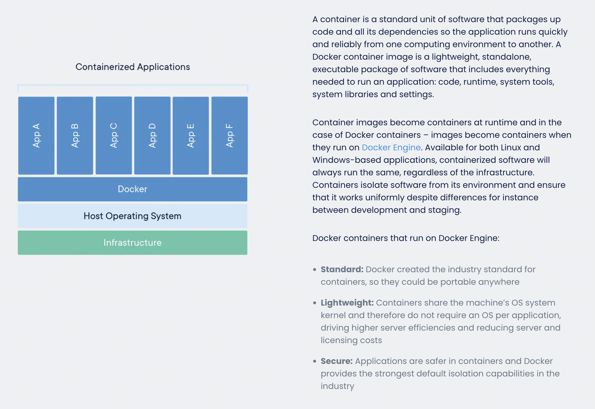
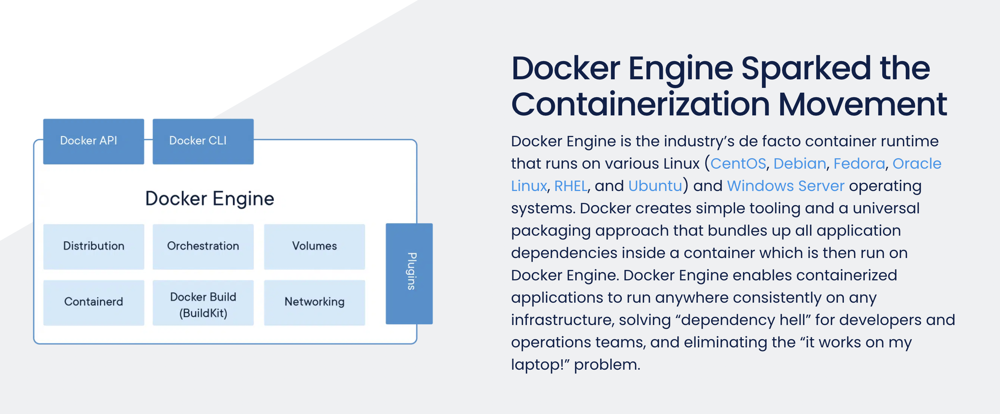
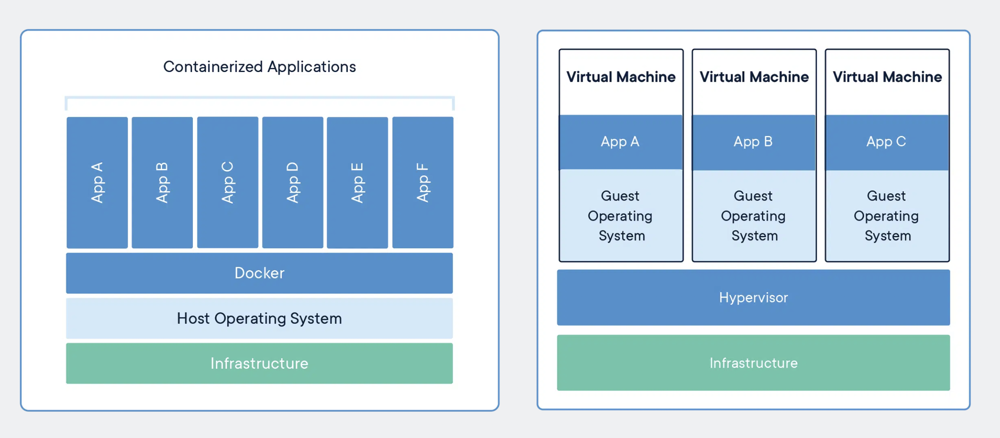

# Sub2 STOMP를 이용한 채팅 구현 및 Docker 학습

 확인합니다
다시다시

<aside>
💡 **도커(Docker)** : 리눅스의 응용 프로그램들을 프로세스 격리 기술들을 사용해 컨테이너로 실행하고 관리하는 오픈 소스 프로젝트

</aside>

# Docker

Docker는 개발자로 하여금 그들의 어플리케이션을 환경 구성의 고민으로부터 해방을 시켜주는 표준화된 단위인 컨테이너를 기반으로 동작하고 있다.

## Container

코드와 코드의 모든 Dependency들을 포장하는 규격화된 단위, 이는 어플리케이션이 다른 환경에서도 빠르고 확실하게 동작하도록 해준다. 이러한 도커는 어플리케이션의 실행 환경을 DockerImage라는 것으로 관리를 하는데, 이때 Docker의 이미지는 LightWeight(경량), Standalone(독립적 → 개발 환경에 관계없다), executable package of software(실행가능한 패키지)이다. 

이러한 DockerImage는 Docker Engine을 통해서 container가 되어서 동작한다.

- 위와 같은 구조를 가지는 Docker를 통해서 개발자는 Dependency hell로부터 탈출이 가능하다.
- 개발자와 운영팀으로 하여금 프로그램이 자신의 환경에서만 돌아가는 문제로부터 해방을 시켜준다.

## Docker를 사용하면 무엇이 좋을까?

→ 왼쪽은 Docker를 사용해서 Aplication을 Container 단위로 실어서 작동시키는 것, 오른쪽은 기존의 방식대로 VM을 하나씩 동작시켜서 Application을 동작시키는 방법

- 기존의 방식대로 VM을 하나씩 파서 Application을 동작시키기 위해서는 Application을 동작시키기 위한 환경을 각 VM마다 하나씩 하나씩 설정해주어야 한다는 문제가 있다. 그리고 Hypervisor라는 것을 두어서 VM을 직접 하나씩 관리해야 한다는 문제도 있다.
- 하지만 왼쪽 그림은 Application을 각자의 VM을 파지 않고, Host os만 하나 두고 거기에 Docker를 설치하고 Docker Engine 위에다가 Application container를 올려두는 형식으로 Application을 동작시키고 있다. Docker container들은 모두 Docker CLI를 통해서 조작하는게 가능하므로 Server를 관리하는데도 큰 이점을 가져올 수 있다.

👉🏻 **Container를 CLI를 통해서 관리할 수 있다는 것은 큰 장점**이다. 이는, Docker container들의 동작을 코드를 통해 자동화할 수 있다는 의미이기 때문

 

## Spring 프로젝트를 Docker를 이용해 배포하기
과정 정리한 노션 링크 : https://www.notion.so/Spring-Docker-302c8f4aabab4d69b26bb66f5504972a?pvs=4
